# RSG_Graph_Motif_Counter
Calculate the distribution of motifs in RSG Graph

For any given graph, such as this one:

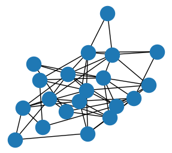

We can generate graph motif distribution vector, which represents the motif distribution of this graph.

This distribution could be of any size, according to the amount of motifs you may want to use.

For example, Here we generate the motif distribution vector of the previous random graph using graph motifs from 1 node to 6 nodes. Here is the distribution:

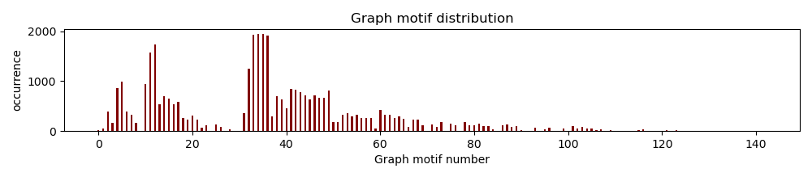

However, for a somehow larger, and denser graph, things will go weird:

Like this one, it takes much more time to calculate.

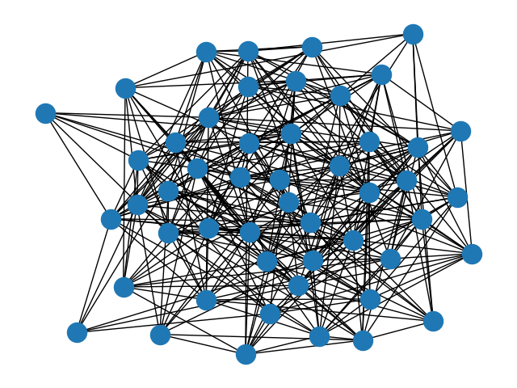

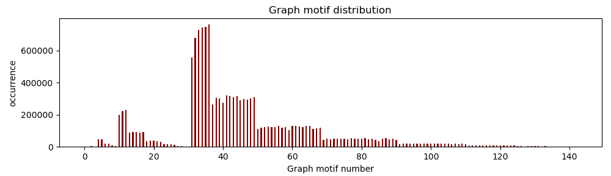

And calculating this will take a long time...

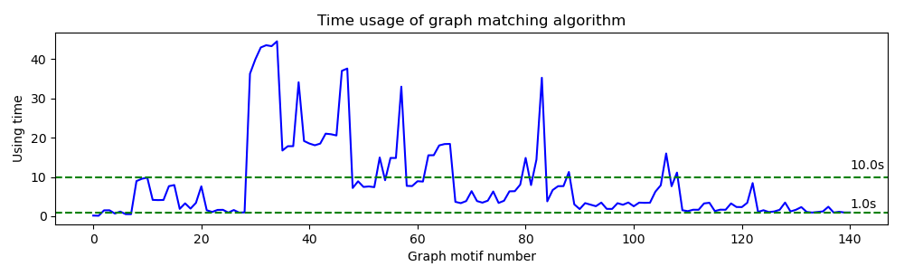

## Pre-computed graph motifs

Here we list all connected graph motifs with in size 1-7

You can load them easily without any time-consuming calculation.

Graph motifs stores in ```data/```

### Size-1 Graph Motif

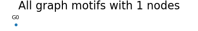

### Size-2 Graph Motif

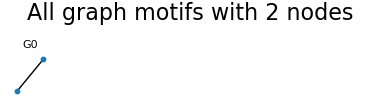

### Size-3 Graph Motif

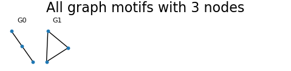

### Size-4 Graph Motif

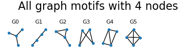

### Size-5 Graph Motif

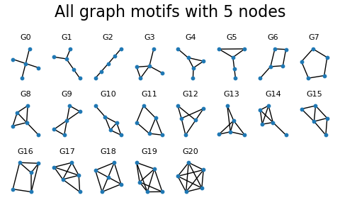

### Size-6 Graph Motif

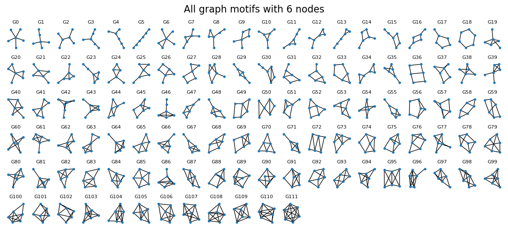

### Size-7 Graph Motif

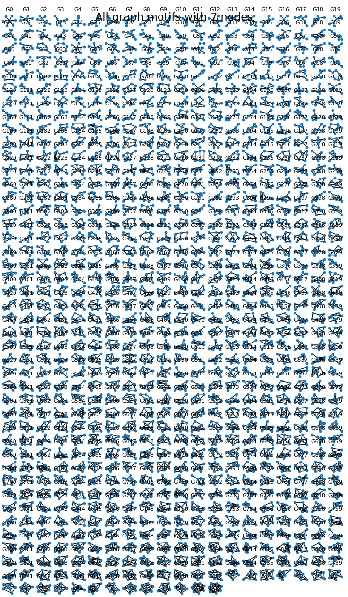


